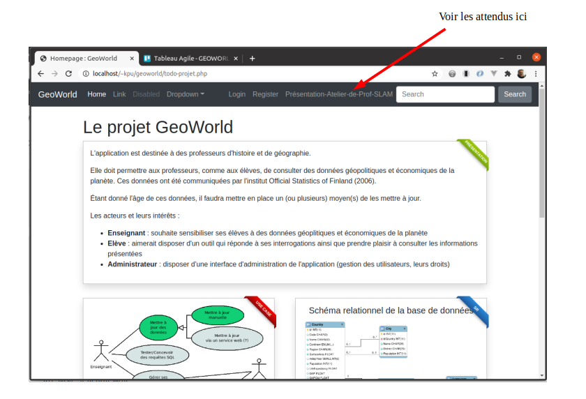

# Geoworld 


[source blender de l'image](https://www.blendernation.com/wp-content/uploads/2019/03/Ring_Of_Iron04_branded.png)

Projet pédagogique pour étudiant apprenti développeur.

### Prérequis :

* Base de PHP
* Base de SQL
* Base de HTML/CSS

Opérationnels sur votre machine :
* PHP
* MySQL
* git 
* un IDE 

### Prétention du projet

* Apprendre à travailler sur la base d'un existant simple
* Apprendre à respecter des conventions de codage
* Initier à une architecture 3 tiers Web simple
* Développer la créativité
* Un peu de méthodologie (user story, trello, phpcs, ...)

### Limite du projet 

* Pas d'usage de framework pour la structuration du projet 
* Pas de prise en compte de la sécurité au début du projet
* Pas une initiation au gestionnaire de version `git` non plus
* Pas de problématique de déploiement (à dockeriser ?)

Initié au lycée Léonard de Vinci - 77000 Melun


### Variables d'environnement

Pour des raisons pratiques, assurez-vous d'avoir accès aux programmes `mysql` et `php` à partir de la ligne de command.

Exemple pour `mysql` :

```
$ mysql -V

mysql  Ver 8.0.31-0ubuntu0.22.04.1 for Linux on x86_64 ((Ubuntu))
```


Exemple pour `php` :

```
$ php -v

PHP 8.1.2-1ubuntu2.9 (cli) (built: Oct 19 2022 14:58:09) (NTS)
Copyright (c) The PHP Group
Zend Engine v4.1.2, Copyright (c) Zend Technologies
    with Zend OPcache v8.1.2-1ubuntu2.9, Copyright (c), by Zend Technologies
```

Si vous recevez un message système qui vous informe qu'il ne reconnait pas les commandes `php` et/ou `mysql`, alors vous devez configurer la variable d'environnement `PATH` en conséquences. Exemple de procédure sous windows 10 :

Pour configurer la variable d'environnement PATH sous Windows 10, veuillez suivre ces étapes :

1. Appuyez sur la touche Windows + X et sélectionnez "Système".
2. Dans la fenêtre qui s'ouvre, cliquez sur "Paramètres avancés du système".
3. Dans la nouvelle fenêtre qui s'ouvre, cliquez sur "Variables d'environnement".
4. Dans la section "Variables d'environnement", recherchez la variable `Path` dans la liste des variables système et sélectionnez-la. Cliquez sur "Modifier".
5. Dans la fenêtre "Modifier la variable d'environnement", cliquez sur "Nouveau" et ajoutez le chemin d'accès complet au répertoire contenant les fichiers exécutables PHP et MySQL. Par exemple, si PHP et MySQL sont installés dans le répertoire `C:\php\bin` et `C:\wamp`, vous devriez ajouter ces deux chemins d'accès à la liste. Exemple pour `mysql`, les exécutables seraient dans le dossier bin : `C:\wamp\bin\database\mysql\mysql-5.5.9\bin`
6. Cliquez sur "OK" pour fermer toutes les fenêtres et enregistrer les modifications.
7. Une fois ces étapes terminées, fermer toutes les fenêtres d'invite de commandes, car ces fenêtres sont basées sur les anciennes valeurs des variables d'environnement.
8. **Ouvrir une nouvelle fenêtre d'invite de commandes (console, terminal)**
À partir de la nouvelle invite de commande, vous devriez être en mesure de lancer la commande `php -v` et `mysql -V` depuis n'importe quel emplacement de votre système. Si vous rencontrez toujours des problèmes, assurez-vous que PHP et MySQL sont correctement installés et que les chemins d'accès que vous avez ajoutés à la variable d'environnement PATH sont corrects.


### Installation (tiers DB)

Dans le dossier `/doc` vous trouverez les scripts `MysSQL` pour créer le schéma de la base de données et un autre pour insérer des données.

1. Connexion à MySQL 
```
$ sudo mysql
```

ou 
```
$ mysql -u root
```

2. Création de la base de donnée
```
mysql> create database geoworld; 
```

3. Création d'un utilisateur

```
mysql> create user 'appuser'@'%' identified by 'ThePassword';
```

4. Définition des droits de l'utilisateur sur la base de données `geoworld`
```
mysql> grant all on geoworld.* to 'appuser'@'%';
```
Remarque : En production, les droits gagneraient à être moins large...

5. Test de connexion (le mot de passe doit être saisi en ligne de commande)
```
mysql> exit
$ mysql -u appuser geoworld -p
```

Vous pouvez maintenant quitter `mysql`.

### Installation de l'application (tiers Application Backend)

Se placer dans un dossier de travail, ouvrir une console (terminal).

1. Installez l'application `geoworld` dans ce dossier.

```
$ git clone https://github.com/sio-melun/geoworld.git
```

2. se placer dans le nouveau dossier
```
$ cd geoworld
```

### Initialisation de la base de données (tiers DB)

Se placer dans le dossier de l'application, ouvrir une console (terminal).

*Prérequis 1* : La base de données `geoworld` a été précédemment créée, elle est vide.

*Prérequis 2* : L'utilisateur `appuser` existe et a des droits sur la base de données `geoworld`.

1. Création du schéma relationnel de la base de données (les tables)

Une bonne façon de tester les droits de l'utilisateur `appuser` sur `geoworld`.  

```
$ mysql -u appuser -p geoworld < doc/world-schema.sql
```

2. Insertion des données (lignes des tables)

(rappel : _nous sommes en ligne de commande_) 
```
$ mysql -u appuser -p geoworld < doc/world-data.sql
```

### Test de l'application (tiers Application backend)

Se placer **dans le dossier de l'application**, ouvrir une console (terminal).

1. Lancement de l'application (un serveur HTTP qui sait interpréter du code PHP)
```
php -S localhost:8000
```

2. Connexion à l'application

À l'aide d'un navigateur, ouvrir l'URL : [localhost:8000](localhost:8000)

### Point d'entrée de l'application


